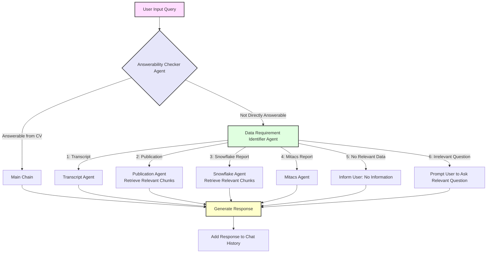

# Profile Query System

## Overview
The **Profile Query System** is a chatbot application that extracts information from structured and unstructured documents related to a user’s profile, such as their resume, transcripts, publications, and reports. The chatbot uses a LangChain-based architecture and FAISS for vector search, enabling context-aware responses to user queries.

This project is structured using object-oriented programming (OOP) principles, ensuring scalability, modularity, and maintainability

---

## Features
- Extracts text from PDFs and DOCX files.
- Builds and saves FAISS-based vector stores for efficient information retrieval.
- Uses a Large Language Model (LLM) to answer queries.
- Handles multi-agent chaining to dynamically route queries to the relevant information source.
- Provides a chatbot interface using **Gradio** for user interactions.

---

## How It Works

1. **File Reading**: The system extracts text from PDF and DOCX files using `file_reader.py`.
2. **Vector Store Creation**: Text is split into chunks and stored in a FAISS vector store for fast similarity search.
3. **Agent-Based Query Routing**: A multi-agent system routes user queries to the relevant information source (e.g., CV, transcript, publication).
4. **Chat Interface**: A Gradio-based chatbot interface enables users to interact with the system.

---

## Agent Flow Chart
Below is the flow of agents in the system:

---

## Example Queries
Here are some example queries and how the system responds:

1. **"Where did Sarwesh do his college?"**
   - The system identifies that the query is answerable from the CV.
   - Response: *"Sarwesh completed his B.Tech + M.Tech in Electrical and Electronics Engineering at IIT Kharagpur."*

2. **"Tell me about Sarwesh's first-semester courses."**
   - The system routes the query to the Transcript Agent.
   - Response: *"Sarwesh's first-semester courses included Advanced Calculus, Programming, and Data Structures."*

---

## Technologies Used
- **LangChain**: For chaining LLM-based prompts and workflows.
- **FAISS**: For efficient vector-based similarity search.
- **PyPDF2** and **python-docx**: For reading text from PDF and DOCX files.
- **Gradio**: For creating a web-based chatbot interface.
- **Python-dotenv**: For managing environment variables.

---

